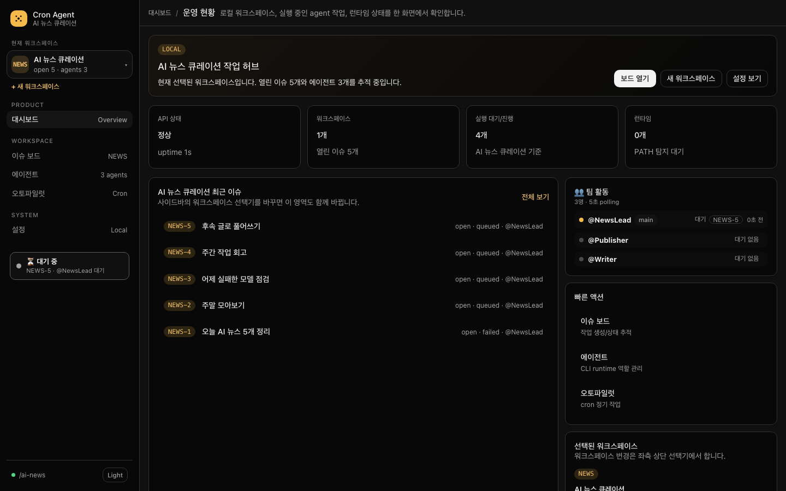
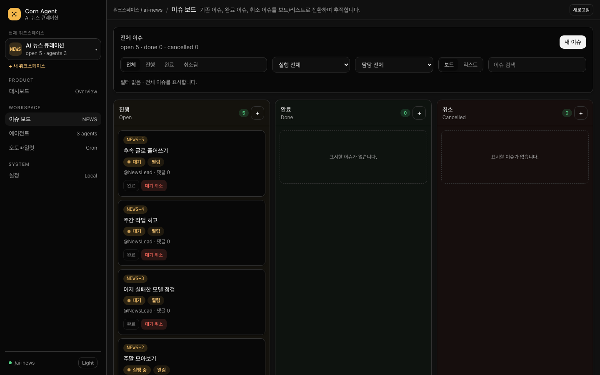
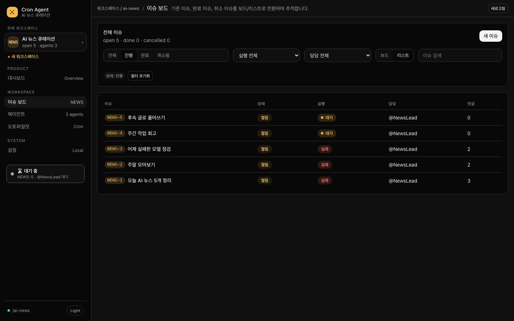
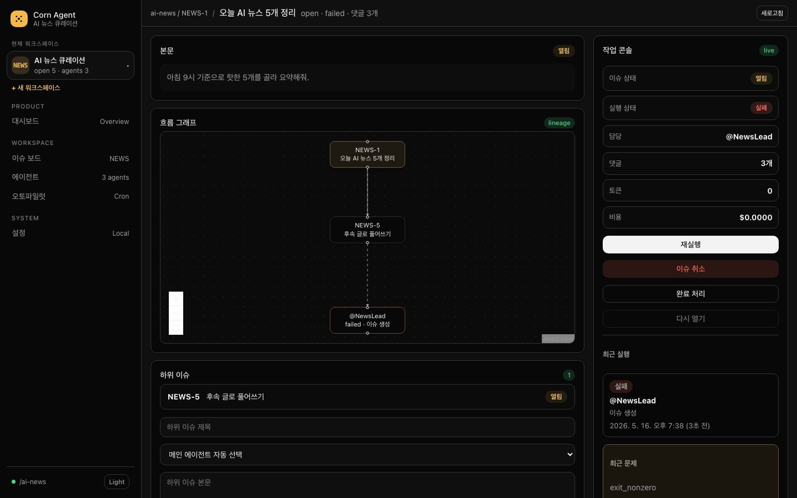
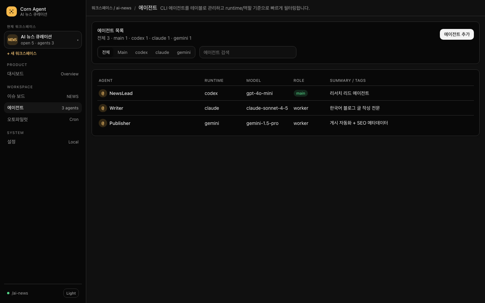
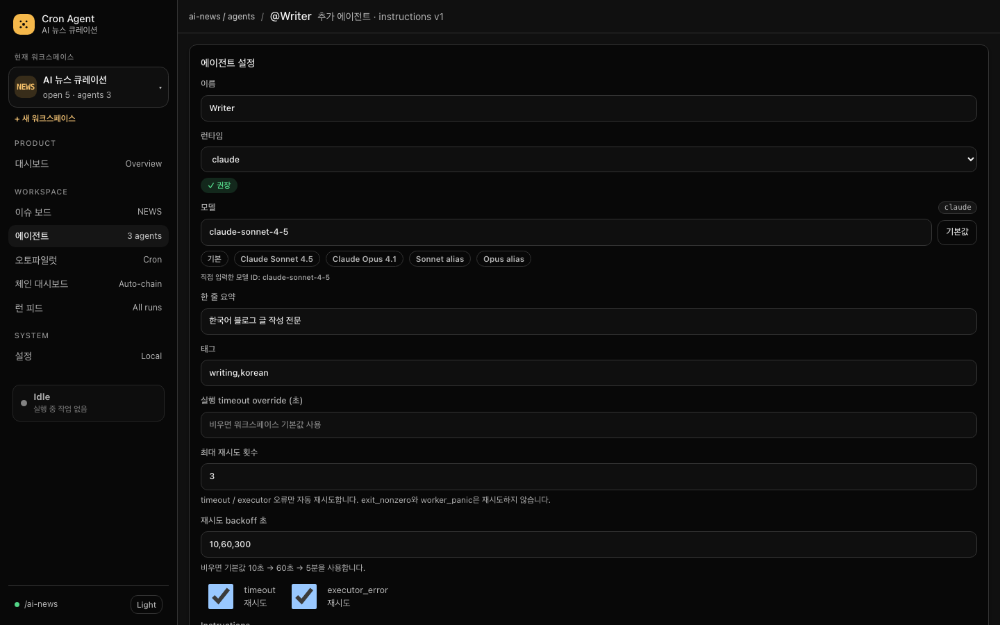
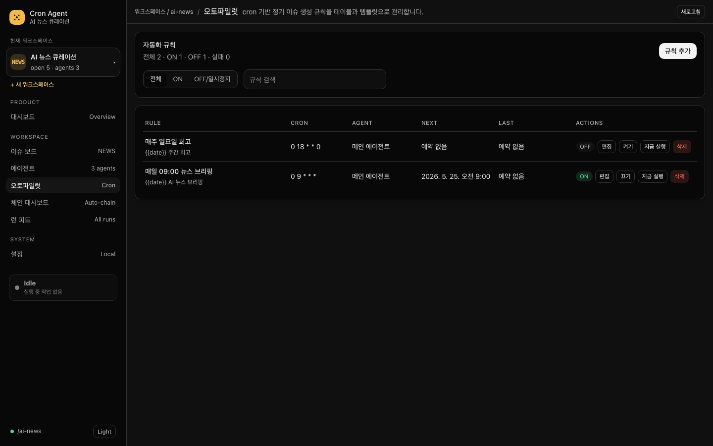
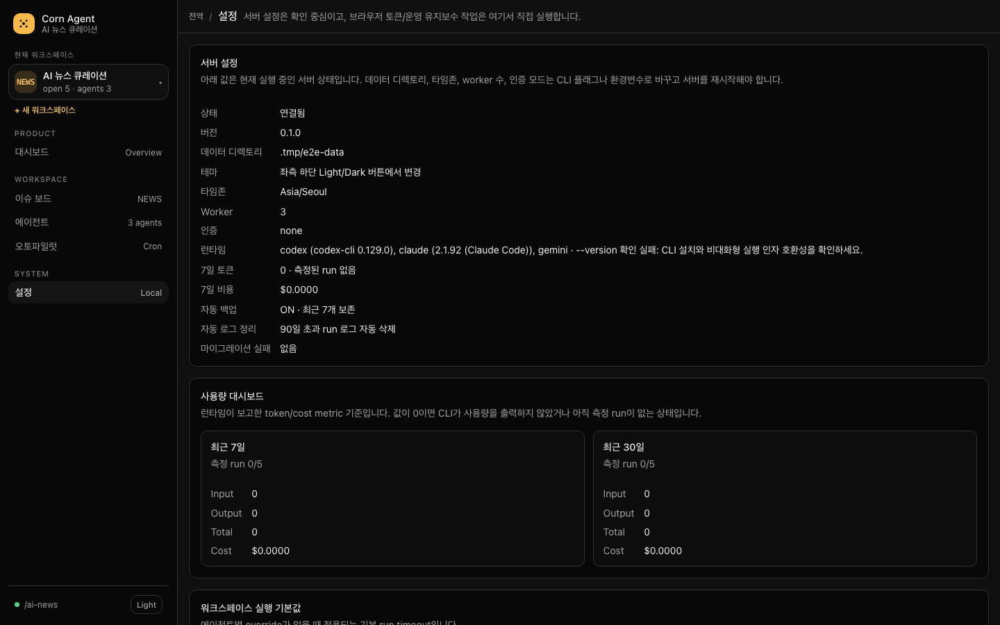
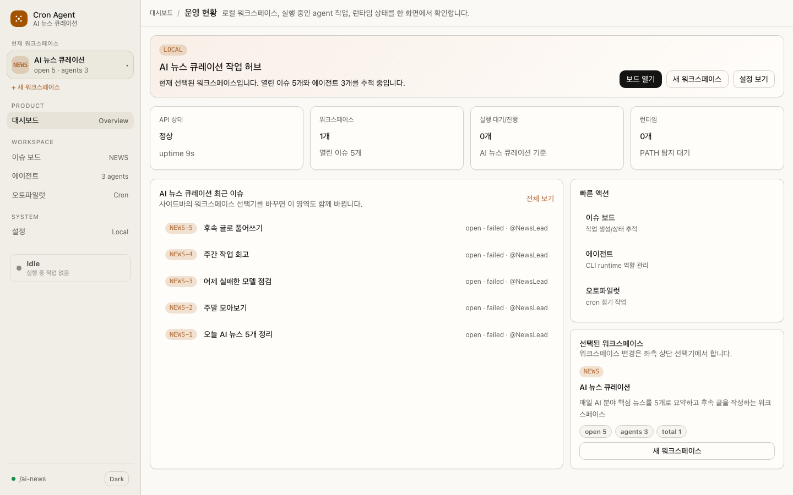

<div align="center">


# 🧭 Cron Agent Dashboard

**혼자 쓰는 AI 에이전트 작업 트래커**
CLI 에이전트(`codex` · `claude` · `gemini`)에게 작업을 지시하고, 결과를 댓글로 추적하고, 정기 작업은 Autopilot으로 자동화한다.

[](docs/ROADMAP.md)
[](#-라이선스)
[](#requirements)
[](#)

[](https://go.dev/)
[](https://www.sqlite.org/)
[](https://github.com/go-chi/chi)
[](https://github.com/jmoiron/sqlx)
[](https://vitejs.dev/)
[](https://react.dev/)
[](https://reactrouter.com/)
[](https://tanstack.com/query)
[](#)
[](#)

[](#)
[](#)
[](#)

</div>

---

## ✨ 한눈에 보기

```text
┌────────────────────────────────────────────────────────────────┐
│  AI 뉴스 큐레이션 (워크스페이스)                                  │
├────────────────────────────────────────────────────────────────┤
│                                                                │
│  [NEWS-15] 오늘 뉴스 정리           🔵 실행 중 · @NewsLead       │
│  [NEWS-14] 주말 모아보기             🟢 완료   · @Publisher      │
│  [NEWS-13] 어제 실패한 작업           🔴 실패   · @NewsLead       │
│                                                                │
│  [+ 새 이슈]                                                    │
│                                                                │
├────────────────────────────────────────────────────────────────┤
│  ⏰ Autopilot: 매일 09:00 → NewsLead         ON · 다음 09:00     │
│  ⏰ Autopilot: 매주 일요일 18:00 → Publisher  OFF                │
└────────────────────────────────────────────────────────────────┘
```

> [!IMPORTANT]
> **이 프로젝트는 현재 v0.1 안정화 이후 Phase 2 핵심 기능까지 반영된 상태입니다.** Go SQLite/API, worker/store/main 실행 연결, DB-backed Autopilot scheduler, Vite React read/write UI, Go `embed.FS` 단일 바이너리 서빙, CLI backup/restore/workspace import-export, startup self-check, Playwright browser smoke, clean clone 검증 스크립트, GitHub Release 업로드 workflow가 모두 동작합니다. 코드 분할(store 19 파일 / httpapi 13 파일), **68개 API route(+ `/healthz`)**, **24개 SQLite migration**, sentinel 에러 16종, panic cooldown, heartbeat 기반 stale 회수, startup self-check 시 gopsutil 기반 orphan process 검증(평시 stale scan은 heartbeat-only), react-error-boundary, @xyflow/react 흐름 그래프, Agent Skills registry, workspace opt-in auto-chain guard(main agent PM hub 재진입 허용), chain dashboard, issue attachments, outbound webhooks, per-run worktree opt-in, SSE run_event streaming, Homebrew tap publish workflow, workspace history import materialization, worktree disk usage/GC, e2e-full CI gate까지 적용된 상태입니다. 2026-05-23 기준 `go test ./...`, `go test -race ./...`, `go vet ./...`, `pnpm --filter web build`, `pnpm --filter web test`, `make e2e-smoke`, `make e2e-full`, `govulncheck ./...`, `pnpm audit --prod`, `pnpm audit`를 통과했습니다.

> [!TIP]
> **품질 지표 (2026-05-23 기준)** — Go production **13,097 LOC** · Web production **10,656 LOC** · 자동화 테스트/스펙 **93 파일 / 12,854 LOC**(Go test 65 · Vitest 15 · Playwright 12 + fixture 1) · `go test -race ./...` clean · TypeScript strict · sentinel 에러 16종 · single-direction migration **24개**.

### 🔎 코드 레벨 전문가 분석 요약 (2026-05-23)

| 영역 | 판정 | 근거 |
|---|---|---|
| 아키텍처 | 안정적 | HTTP/store/worker/runtime/scheduler가 분리되어 있고, queue는 SQLite row 기반 durable claim으로 동작 |
| 실행 lifecycle | 강함 | heartbeat, stale/orphan recovery, process group kill, cancel race guard, panic cooldown, run_event audit trail 보유 |
| 보안 기본값 | 양호 | localhost 기본, 외부 bind token 강제, CORS allowlist, CSP/security headers, body cap, backup path 제한, private file permission 적용 |
| 프론트엔드 | 실사용 가능 | fetch 기반 SSE issue detail refresh + React Query polling fallback, URL 필터, error boundary, safe markdown, run graph, token local/session storage 지원 |
| 남은 개선 후보 | 모두 닫힘 (2026-05-23) | SSE 스트리밍 · Homebrew tap publish CI step · workspace history import materialization · worktree 디스크 사용량 관측 + configurable GC · e2e-full 필수 CI gate 모두 적용. 다음 후속은 운영 중 발견되는 새 항목에서 시작 |

---

## 📑 목차

- [화면 둘러보기](#-화면-둘러보기)
- [왜 만드는가](#-왜-만드는가)
- [핵심 가치](#-핵심-가치)
- [기능](#-기능)
- [아키텍처](#-아키텍처)
- [기술 스택](#-기술-스택)
- [빠른 시작](#-빠른-시작)
- [사용법](#-사용법)
- [설정](#-설정)
- [문서](#-문서)
- [로드맵](#-로드맵)
- [디자인 원칙](#-디자인-원칙)
- [기여](#-기여)
- [라이선스](#-라이선스)

---

## 📸 화면 둘러보기

> 모든 캡쳐는 `make screenshots`로 다시 생성할 수 있습니다(Playwright로 데모 워크스페이스를 시드 후 주요 화면/상태를 캡쳐). 파일은 [`docs/screenshots/`](docs/screenshots/)에 저장됩니다. 본 README에 사용된 캡쳐는 1440×900 viewport / 다크 테마 기준입니다.

### 1. 대시보드 — 워크스페이스 운영 허브



- 좌측 사이드바: 현재 워크스페이스 스위처(검색 + 다중 워크스페이스), Product/Workspace/System 메뉴 그룹, 하단 status dot + 테마 토글
- 상단 hero 카드: 선택된 워크스페이스의 열린 이슈/에이전트 수 요약과 빠른 액션(`보드 열기`/`설정 보기`)
- 메트릭 4종: **API 상태 · uptime**, **워크스페이스 개수 + 열린 이슈 합계**, **현재 워크스페이스 기준 queued/running**, **PATH에서 감지된 런타임 목록**
- 최근 이슈 리스트는 워크스페이스 변경에 따라 자동 갱신되고, 5개 초과 시 `더 보기 (+N)` 토글로 5줄 점진 노출
- 우측 사이드 패널: 빠른 액션(보드/에이전트/오토파일럿) + 선택된 워크스페이스 요약 카드

### 2. 이슈 보드 — Kanban + 리스트 듀얼 뷰



- 컬럼: **진행(open)** / **완료(done)** / **취소(cancelled)** — 각 컬럼 헤더 `+` 아이콘으로 해당 상태 hint와 함께 새 이슈 생성
- 카드에 `NEWS-12` 같은 사람이 읽는 식별자, 실행 상태 배지(대기/실행 중/실패/완료), 담당 에이전트(`@NewsLead`), 댓글 수
- 카드 액션: `완료` / `이슈 취소` / `대기 취소` / `실행 취소` — 진행 중 run이 있으면 위험 버튼만 활성화
- 툴바: **상태 segmented**, **실행 상태 select**, **담당 에이전트 select**, **보드↔리스트 토글**, **이슈 검색 input** 모두 URL 쿼리(`?status=...&execution=...&agent=...&view=...&q=...`)에 동기화 → 북마크/새 탭 시 그대로 복원
- 좌측 사이드 status dot은 폴링 상태(`Loading workspace`/`/{slug}`)를 항상 표시



- `?view=list&status=open` 필터 결과: 한눈에 더 많은 row를 비교하기 좋은 테이블 뷰
- 컬럼: **이슈 식별자 + 제목 / 상태 배지 / 실행 배지 / 담당 / 댓글 수**
- 활성 필터는 `상태: 진행 / 필터 초기화` chip으로 상단에 표시되어 의도하지 않은 빈 결과를 즉시 인지할 수 있도록 함

### 3. 이슈 상세 — 흐름 그래프 + 댓글 + 작업 콘솔



- 좌측 메인:
  - **본문 패널**: `react-markdown` + `remark-gfm`로 안전 렌더 (raw HTML/script 차단, XSS smoke 회귀로 보호)
  - **흐름 그래프 (`@xyflow/react`)**: parent issue → 현재 이슈 → sub-issue / chained run의 lineage를 시각화. 노드 클릭으로 자식 페이지 이동
  - **하위 이슈 패널**: parent-child 관계 보존 + 폼으로 즉시 sub-issue 생성
  - **댓글 스레드**: agent/result/system/user 출처 표시, 댓글 truncated 배지 + log 링크, `MentionAutocomplete`로 `@AgentName` 자동완성(키보드 ↑↓ Enter)
  - **Run 이력 패널**: 각 run의 `terminal_reason / failure_kind / cancel_reason`, heartbeat, instructions version, token/cost/model, attempt 진행, parent run, chain depth, retry schedule, exit code, stdout size, 이벤트 타임라인까지 모두 노출
- 우측 작업 콘솔(`IssueSummaryRail`):
  - 이슈 상태 · 실행 상태 · 담당 · 댓글 수 · 누적 token · 누적 cost
  - `재실행` / `이슈 취소` / `완료 처리` / `다시 열기` 버튼이 issue/run 상태에 따라 활성 토글
  - `최근 실행` 블록에 마지막 run의 agent · started_at · 실패 사유까지 즉시 표시

### 4. 에이전트 — 테이블 + 필터 + 검색



- 카운트 헤더: 전체 / main / codex / claude / gemini를 항상 표시
- `Main / codex / claude / gemini` 세그먼트 필터 + 이름·요약·tag 검색
- 테이블 컬럼: **이름(@), runtime, model, role(main/worker), summary/tags**
- 메인 에이전트는 `main` 배지로 구분 — case-insensitive 이름 유일 제약은 서버에서 강제



- 폼: 이름 / runtime select(codex/claude/gemini) / model select / summary / tags / timeout override / `max_attempts` + backoff(`10,60,300` 형태) / 재시도 정책(timeout / executor_error 체크박스) / instructions textarea
- `메인으로 승격` 버튼: 비-main에서만 활성, 클릭 시 다른 에이전트는 자동 worker로 강등 — 메인 에이전트 invariant 유지
- 삭제 버튼은 main에서 비활성
- 하단 **Instructions 버전 이력**: instructions를 바꿀 때마다 자동 snapshot — 과거 run이 어떤 instructions 기준으로 실행됐는지 추적 가능
- **Agent Skills**: `SKILL.md` 호환 지침을 workspace registry에 등록하고 에이전트별로 `always` / `trigger` / `manual` 모드로 할당. 등록된 스크립트는 자동 실행하지 않고 prompt fence 안의 안전한 지침 context로만 주입

### 5. 오토파일럿 — Cron 자동화 규칙



- 카운트 헤더: 전체 · ON · OFF/일시정지 · 실패 — 한 줄로 운영 상태 요약
- 테이블 컬럼: **Rule(이름 + 제목 템플릿), Cron, Agent, Next, Last, Actions(`ON/OFF` 배지 · `편집/끄기/지금 실행/삭제`)**
- `지금 실행`은 cron 트리거 없이도 즉시 이슈를 생성해 동일 흐름으로 실행 가능 — 디버깅용
- 5회 연속 실패 시 룰 자동 OFF + `실패 N` 배지 + 마지막 오류 hover 표시
- 룰이 0개이면 `자주 쓰는 템플릿` 3종(매일 09:00 뉴스 / 주간 회고 / 월요일 문서 갭) 카드로 시작 유도

### 6. 설정 — 운영 콘솔



- **서버 설정** (읽기 전용): 버전, 데이터 디렉토리, 타임존, worker 수, 인증 모드, 감지된 런타임 + version + warning, 7일 token/cost, 자동 백업 보존 개수, 자동 로그 정리 기준, 마이그레이션 실패 이력
- **사용량 대시보드**: 최근 7일 / 30일 input·output·total token + cost, 측정 run 수(`run_count` 대비 `measured_run_count`)
- **워크스페이스 실행 기본값**: workspace별 `default_timeout_seconds` + auto-chain 5중 가드(ON/OFF · 최대 chain depth · 24시간 run 제한 · 24시간 비용 제한 · dry-run)
- **운영 작업**: `DB 백업 (경로 옵션)` / `Vacuum` / `Run 로그 정리 (보존 일수)` — 결과는 하단 메시지 영역에 표시
- **API 토큰**: 서버가 token mode일 때 사용할 Bearer token을 브라우저 `localStorage`(기본) 또는 `sessionStorage`(이번 세션만)에 저장/삭제(서버에 저장되지 않음)

### 7. 라이트 테마



- 좌측 사이드바 하단 `Light/Dark` 버튼으로 즉시 전환, 선택은 `localStorage`에 보존 → 새 탭/새로고침에서도 유지
- 디자인 토큰만 토글되고 컴포넌트 구조는 그대로 — 색상 대비/접근성 동일

---

## 🎯 왜 만드는가

기존 **Cron Design Reference**는 팀/조직을 가정한 풀스택 시스템(Postgres + Daemon + Frontend + Desktop)이라 **단일 사용자에게는 토큰 낭비 + 운영 복잡도**가 발생한다.

**Cron Agent Dashboard**는 Cron Design Reference의 검증된 UX(보드 / 댓글 / 멘션 위임)는 보존하면서 단일 사용자에게 불필요한 모든 기능을 제거한 **경량 단일 바이너리** 버전이다.

| 항목 | Cron Design Reference | Cron Agent Dashboard |
|---|---|---|
| 프로세스 | Postgres + Daemon + Frontend + Desktop = **5** | **1** (단일 Go 바이너리) |
| DB | PostgreSQL 17 + pgvector | **SQLite 1 파일** |
| 인프라 | `docker-compose` × 5 services | **없음** |
| Frontend | Next.js 16 (SSR/RSC) | **Vite + React Router SPA** |
| Realtime | WebSocket Hub | **SSE run_event stream + HTTP polling fallback** |
| 인증 | OAuth + PAT + Daemon Token | **무인증** (옵션: 단일 토큰) |
| 멤버 / 권한 | RBAC + invite | **단일 사용자** |
| Go 코드 규모 | ~25,000 LOC | **~8,824 LOC + 5,584 LOC Go tests** |
| Frontend 규모 | 40+ 페이지 | **7 페이지 (~5,620 LOC TS/TSX)** |
| 테스트 | 통합/E2E 분리 | **49 test/spec 파일 · `go test -race` clean** |
| 마이그레이션 | Atlas/Goose | **16 single-direction SQL** (0001~0016) |

---

## 💎 핵심 가치

<table>
<tr>
<td width="33%" valign="top">

### 📋 작업 트래커
이슈 만들기 → 자동 실행 → 결과 댓글로 영구 기록.
사람이 읽는 식별자 `NEWS-12`로 북마크 가능.

</td>
<td width="33%" valign="top">

### 🔗 멘션 위임
`@Writer 이걸로 블로그 글 써줘` 한 줄이면 다음 에이전트로 위임.
같은 이슈에 시간순 누적.

</td>
<td width="33%" valign="top">

### ⏰ Autopilot
cron 기반 정기 이슈 자동 생성.
`매일 09:00 → NewsLead → 뉴스 정리`.
룰별 일시정지(snooze), 실패 가시성, 5회 연속 실패 자동 OFF를 지원한다.
Run별 token/cost/model metrics는 CLI가 usage 정보를 출력하는 경우 best-effort로 기록한다.
에이전트 instructions는 version history로 보존되어 run 재현 기준을 추적할 수 있다.
Agent Skills registry로 재사용 가능한 `SKILL.md` 지침을 에이전트별로 안전하게 활성화할 수 있다.

</td>
</tr>
<tr>
<td width="33%" valign="top">

### 🚀 단일 바이너리
`./cron-agent-dashboard serve` 한 줄.
SQLite 파일 옆에 둠. 외부 의존 0.

</td>
<td width="33%" valign="top">

### 💾 Durable Queue
DB-backed 큐. 프로세스 재시작에도 작업 손실 없음.

</td>
<td width="33%" valign="top">

### 🎨 한국어 로컬 UI
Plain CSS 기반 디자인 시스템.
다크/라이트 테마와 한국어 운영 문구.

</td>
</tr>
</table>

---

## ✅ 기능

### MVP (Phase 1)

- [x] 📐 설계 완료 — PRD / TRD / ARCHITECTURE / DATA_MODEL / API / UX / ROADMAP
- [x] 🧱 초기 구현 스캐폴드 — Go module / SQLite migration / REST API skeleton / worker·scheduler skeleton / Vite React routes
- [x] ⚙️ Worker/Scheduler 연결 — queued run claim/execution 반영, active cancel 요청, DB-backed Autopilot reload
- [x] 🗂️ 워크스페이스 생성/조회/수정/삭제 API + 생성 UI (이슈 ID prefix · 기본 working_dir)
- [x] 🤖 메인 에이전트 1개 + 추가 에이전트 N개 CRUD UI/API (case-insensitive 이름 유일)
- [x] 🎫 이슈 트래커 (`identifier` `NEWS-12`, status: `open` / `done` / `cancelled`)
- [x] 💬 댓글 스레드 + system 댓글 (실행 시작 / 취소 / 경고)
- [x] 🔀 `@AgentName` 멘션 위임 — **assignee는 바꾸지 않음**, 같은 이슈에 새 run 추가
- [x] 🧭 체이닝 정책 — 기본은 explicit-only, workspace opt-in 시 agent 결과 댓글의 첫 `@AgentName` 자동 체이닝
- [x] 🌿 Sub-issue — 이슈 상세에서 하위 이슈 생성/조회, 부모-자식 관계 보존
- [x] 🧷 Run context sharing — workspace `.cron-runs/<run-id>.log` 경로로 run stdout 참조
- [x] 🏷️ Agent metadata — summary/tags와 retry backoff 정책 관리
- [x] 🧾 Agent instructions version history — instructions 변경 이력 + run snapshot
- [x] 🧩 Agent Skills registry — `SKILL.md` 호환 지침 등록/할당, `always` / `trigger` / `manual` prompt 주입
- [x] ⏰ Autopilot (robfig/cron, 시스템 timezone `Asia/Seoul` 기본)
- [x] 🔁 [재실행] — 마지막 run의 agent로 자동 dispatch
- [x] 🛑 [취소] — process group SIGTERM → 30초 후 SIGKILL
- [x] 💾 Durable queue (`run.status='queued'` row 기반 DB claim)
- [x] 🔐 옵션 토큰 인증 (`CRON_AGENT_DASHBOARD_TOKEN`)
- [x] 📦 단일 바이너리 (Go embed.FS로 Vite SPA 포함)

### Phase 2+

- [x] 🌲 부모 / 서브 이슈 트리 + run lineage graph 기본형
- [x] 🛡️ Workspace별 auto-chain dry-run / depth / 24h run·cost guard
- [x] 🧯 운영 hardening — 보안 헤더/CORS/token/body cap/backup path/file permission/govulncheck CI
- [x] 🔗 Auto-chain 고급 chain 관리 UI — 이슈 상세 chain summary + chain cancel/retry + workspace chain dashboard(`/w/:slug/chains`)
- [x] 📎 첨부 파일 — multipart upload/download/delete + audit log + image inline preview + comment-linked attachments
- [x] 🌳 per-run worktree — workspace opt-in 동시 실행, git repo는 `git worktree add --detach`/`remove --force`, 비-git 경로는 isolated mkdir fallback
- [x] 📤 워크스페이스 import/export — CLI `workspace-export`/`workspace-import`, HTTP export, history export + PII masking
- [x] 🔔 외부 webhook — workspace 구독, HMAC-SHA256 서명, mask_pii, exponential retry, dead-letter 배지
- [x] 📡 Realtime streaming — `/api/issues/{id}/events/stream` SSE + fetch-based subscriber in IssueDetailPage
- [x] 🍺 Homebrew tap publish — release CI가 formula를 채워 release artifact로 업로드 + secret 설정 시 opt-in tap PR 생성
- [x] 🧹 per-run worktree 운영 관측 — 매 maintenance tick마다 `<data>/worktrees/` 사용량 측정 + `--worktree-gc-after`(기본 24h) 이상 미사용 terminal/orphan 디렉터리 GC(queued/running 보호) + Settings UI 노출
- [x] 📥 workspace history import 복원 — `ImportOptions.IncludeHistory`로 issue/comment/run/attachment metadata rematerialize, in-flight run은 `cancelled`로 정착, `per_run_worktree` round-trip 보존
- [x] 🧪 e2e-full CI 승격 — `make e2e-full`이 필수 GitHub Actions job으로 PR/release 회귀를 gate

---

## 🧱 아키텍처

### 시스템 구성

```
┌────────────────────────────────────────────────────────────────┐
│                  Browser (127.0.0.1:8080)                      │
└────────────────────────────┬───────────────────────────────────┘
                             │ HTTP
                             ▼
┌────────────────────────────────────────────────────────────────┐
│        cron-agent-dashboard binary (single process)            │
│                                                                │
│  ┌──────────────────────────────────────────────────────────┐  │
│  │              HTTP Server (chi router)                    │  │
│  │  /api/*  →  REST API (68 routes)                         │  │
│  │  /*      →  embed.FS (Vite SPA + index.html fallback)    │  │
│  └────────────────────┬─────────────────────┬───────────────┘  │
│                       │                     │                  │
│                       ▼                     ▼                  │
│         ┌─────────────────────┐  ┌───────────────────────┐     │
│         │   Store (sqlx)      │  │  Worker Pool (N=3)    │     │
│         │   ─ CRUD            │  │  ─ DB claim polling   │     │
│         │   ─ Transactions    │  │  ─ Runtime adapter    │     │
│         └──────────┬──────────┘  │  ─ Process group kill │     │
│                    │             └───────────┬───────────┘     │
│                    │                         │                 │
│                    ▼                         ▼                 │
│         ┌─────────────────────────────────────────────┐        │
│         │           SQLite (data.db, WAL)             │        │
│         │  workspace · agent · issue · comment ·      │        │
│         │  run · autopilot_rule · schema_migrations   │        │
│         └─────────────────────────────────────────────┘        │
│                                                                │
│  ┌──────────────────────────────────────────────────────────┐  │
│  │       Cron Scheduler (robfig/cron, in-process)           │  │
│  │  ─ Autopilot 룰 등록 / 시각 도래 시 issue + run INSERT    │  │
│  └──────────────────────────────────────────────────────────┘  │
└─────────────────────────────┬──────────────────────────────────┘
                              │ exec.Command (process group)
                              ▼
                ┌─────────────────────────────┐
                │  External CLI agents (PATH) │
                │   codex / claude / gemini   │
                └─────────────────────────────┘
```

### 상태 분리 모델

```
┌──────────────────────────────┐    ┌──────────────────────────────────────────┐
│  issue.status (사용자 의도)   │    │  run.status (실행 상태)                   │
│  open · done · cancelled     │    │  queued · running · done · failed ·       │
│                              │    │  cancelled                                │
└──────────────────────────────┘    └──────────────────────────────────────────┘
                ↕
     execution_status = derived from latest run
            (API 응답에서만 계산)
```

자세한 흐름은 [docs/ARCHITECTURE.md](docs/ARCHITECTURE.md).

---

## 🛠️ 기술 스택

<table>
<tr><th>영역</th><th>기술</th><th>이유</th></tr>
<tr>
<td>Backend 언어</td>
<td></td>
<td>단일 정적 바이너리, 가벼운 동시성</td>
</tr>
<tr>
<td>HTTP 라우터</td>
<td></td>
<td>Cron Design Reference에서 검증, 미들웨어 친화</td>
</tr>
<tr>
<td>DB 드라이버</td>
<td></td>
<td>CGo 없음 → 크로스 컴파일 단순</td>
</tr>
<tr>
<td>SQL 매핑</td>
<td></td>
<td>CRUD + 트랜잭션 계층이 명시적이고 SQLite migration과 함께 테스트하기 쉬움</td>
</tr>
<tr>
<td>Cron</td>
<td></td>
<td>in-process · timezone 지원</td>
</tr>
<tr>
<td>Frontend 빌드</td>
<td></td>
<td>SPA + static export, Next의 RSC 회피</td>
</tr>
<tr>
<td>UI 라이브러리</td>
<td> </td>
<td>단일 SPA에 맞춘 경량 디자인 시스템. 다크/라이트 테마와 운영 화면을 CSS 토큰으로 관리</td>
</tr>
<tr>
<td>상태 관리</td>
<td></td>
<td>polling · 캐시 · 낙관적 업데이트</td>
</tr>
<tr>
<td>라우팅</td>
<td></td>
<td>SPA 동적 라우트</td>
</tr>
<tr>
<td>Markdown</td>
<td></td>
<td>`react-markdown` + `remark-gfm` 렌더링. raw HTML/script 실행 금지</td>
</tr>
<tr>
<td>Lineage Graph</td>
<td></td>
<td>parent issue → sub-issue/run → chained run 흐름 시각화</td>
</tr>
<tr>
<td>UI Safety</td>
<td></td>
<td>단일 페이지 렌더 오류가 white screen으로 번지지 않게 fallback</td>
</tr>
<tr>
<td>Process Probe</td>
<td></td>
<td>orphan PID/PGID 검증 후 process group kill (재기동 시 죽은 PID 제외)</td>
</tr>
<tr>
<td>Storage</td>
<td></td>
<td>1 파일, 무외부 의존</td>
</tr>
</table>

---

## 🚀 빠른 시작

> [!NOTE]
> 로컬에서는 `make build`로 단일 바이너리를 만들 수 있고, GitHub tag `v*.*.*` push 또는 수동 workflow dispatch로 Release artifact 업로드가 자동화됩니다.

### Requirements

- macOS 13+ 또는 Linux (Ubuntu 22.04+)
- Go 1.24+ (`go.mod` 기준, CI/Release는 Go 1.26.3 사용)
- Node.js 22+ · pnpm 10+
- `codex` 또는 `claude` 또는 `gemini` CLI 중 1개 이상 PATH에 설치됨

### 설치

```bash
# Homebrew (tap publish secret 설정 후 release workflow가 Formula PR 생성)
brew install coreline-ai/tap/cron-agent-dashboard

# 또는 직접 다운로드
curl -L https://github.com/coreline-ai/cron-agent-dashboard/releases/latest/download/cron-agent-dashboard-$(uname -s)-$(uname -m) \
  -o /usr/local/bin/cron-agent-dashboard
chmod +x /usr/local/bin/cron-agent-dashboard
```

### 초기화 + 실행

```bash
# 의존성 설치
pnpm install --frozen-lockfile --ignore-scripts

# 데이터 디렉토리 초기화 (~/.cron-agent-dashboard/)
go run ./cmd/cron-agent-dashboard init

# 단일 바이너리 빌드 (web/dist embed 포함)
make build

# (선택) hub-PM 데모 워크스페이스 시드 — Lead + Writer + Reviewer + auto-chain 활성화
./cron-agent-dashboard seed

# (선택) 7개 워크스페이스 멀티 에이전트 실개발 lab 시드
# repo root에서 실행하면 working_dir은 자동으로 현재 git root를 사용합니다.
./cron-agent-dashboard seed-lab
# 또는 명시:
# ./cron-agent-dashboard seed-lab --lab-working-dir "$(pwd)"

# (선택) 단일 워크스페이스 AI dev-team 시드 — Lead/Designer/Backend/Frontend/DB/QA/DevOps + 8 skills
./cron-agent-dashboard seed-dev-team --slug ai-dev-team --working-dir "$(pwd)"

# (선택) 워크스페이스 운영 설정 백업/복제 (workspace + agents + skills + autopilot rules)
# ./cron-agent-dashboard workspace-export --workspace <slug> --to demo.json
# ./cron-agent-dashboard workspace-import --from demo.json --dest-slug demo-clone

# (선택) 워크스페이스 동시 실행을 켜려면 `per_run_worktree`를 활성화하세요.
# 각 run이 <data_dir>/worktrees/<slug>/<run-id>/에서 실행되고
# 같은 워크스페이스의 다른 이슈가 즉시 병렬 claim됩니다. `--workers`를
# 함께 늘려야 동시 실행 효과를 봅니다. working_dir이 git repo이면
# `git worktree add --detach` / `git worktree remove --force`를 사용하고,
# 비-git 경로는 0700 isolated directory로 fallback합니다.

# 백엔드 + 내장 UI 서버 시작
./cron-agent-dashboard serve

# → http://127.0.0.1:8080 접속
# 부팅 시 DB pragma / foreign key / main agent invariant / orphan process cleanup / orphan run recovery self-check가 실행됩니다.
```

> [!CAUTION]
> 기본 운영은 `127.0.0.1` 로컬 접속을 권장합니다. tunnel, reverse proxy, `0.0.0.0` bind처럼 외부에서 접근 가능한 형태로 열 때는 반드시 강한 `--token` / `CRON_AGENT_DASHBOARD_TOKEN`을 설정하세요. 이 앱은 agent CLI 실행, workspace 파일 접근, run log 저장을 수행하므로 workspace와 로그에 민감정보가 남을 수 있습니다.


### 검증 명령

```bash
# Go + frontend + embedded static build gate
make check

# Go race/vet + frontend component tests
go test -race ./...
go vet ./...
pnpm --filter web test

# 보안/의존성 smoke
go run golang.org/x/vuln/cmd/govulncheck@latest ./...
pnpm audit --prod

# 단일 바이너리 기반 브라우저 smoke: workspace → issue → detail → comment
make e2e-smoke

# 메뉴 전 기능 회귀 (Playwright 전체 spec 매트릭스)
make e2e-full

# fresh copy에서 README quick start 재현
make verify-clean-clone

# 릴리스 artifact 생성
make release-build VERSION=v0.1.0
```

### 프론트엔드 개발 서버

```bash
pnpm --filter web dev
# → http://127.0.0.1:5173
# Vite dev server는 /api, /healthz를 127.0.0.1:8080으로 프록시합니다.
```

### Shell alias 제안

binary 이름이 길어서 alias 권장:

```bash
# ~/.zshrc 또는 ~/.bashrc
alias cad='cron-agent-dashboard'

# 이후
cad serve --workers 3 --timezone Asia/Seoul
```

---

## 📖 사용법

### 1. 워크스페이스 + 메인 에이전트 생성

```
[+ 새 워크스페이스]
  이름:        AI 뉴스 큐레이션
  슬러그:       ai-news
  이슈 prefix:  NEWS
  ───── 메인 에이전트 ─────
  이름:        NewsLead
  런타임:       codex
  지시문:       Reddit r/MachineLearning에서 오늘 핫한 5개 정리...
```

### 2. 이슈 만들기 → 자동 실행

`/w/ai-news/board` 에서 `[+ 새 이슈]`:

```
제목:  오늘 뉴스 정리해줘
본문:  (선택)
담당:  NewsLead (기본)
```

→ 즉시 dispatch. 3초 이내 system 댓글로 "NewsLead 실행을 시작했습니다" 표시.
종료 시 결과 댓글로 markdown 결과 INSERT.

### 3. 멘션 위임

NewsLead 결과 아래 댓글:

```markdown
@Writer 이걸로 블로그 글 써줘
```

→ Writer가 같은 이슈에 새 run으로 실행. 댓글 스레드에 누적.

> [!TIP]
> 멘션은 이슈의 **담당자를 바꾸지 않습니다**. 일회성 위임일 뿐이며, [재실행] 버튼은 가장 최근 run의 agent로 동작합니다.

> [!IMPORTANT]
> Auto-chain은 **workspace별 opt-in**입니다. 기본값은 OFF이고, `/settings`에서 켠 workspace에서만 agent 결과 댓글의 첫 `@AgentName`이 다음 run으로 등록됩니다. 최대 depth 5, 같은 chain 내 동일 agent 재호출 차단, system comment/run_event 기록으로 비용 폭주와 루프를 방지합니다.

### 4. Autopilot 룰

`/w/ai-news/autopilot` → `[+ 자동화 추가]`:

```
이름:    매일 09:00 뉴스
주기:    매일 [09:00]
제목:    {{date}} AI 뉴스 정리
담당:    NewsLead
```

매일 09:00에 이슈 자동 생성 + 즉시 실행.

### 5. 결과 회수

이슈 상세 페이지에서 댓글 스레드로 결과 확인. 큰 결과(64KB 초과)는 본문에 일부 + "전체 로그는 [로그 보기](...)" 링크.

---

## ⚙️ 설정

### CLI 플래그

| 플래그 | 환경변수 | 기본값 | 설명 |
|---|---|---|---|
| `--db` | `CRON_AGENT_DASHBOARD_DB` | `~/.cron-agent-dashboard/data.db` | SQLite 파일 경로 |
| `--bind` | `CRON_AGENT_DASHBOARD_BIND` | `127.0.0.1:8080` | HTTP 바인딩 |
| `--workers` | `CRON_AGENT_DASHBOARD_WORKERS` | `3` | 전역 worker pool 크기. 안정성을 위해 같은 workspace 안에서는 기본적으로 run을 직렬 실행하며, 여러 workspace 간 작업은 병렬로 실행될 수 있음 |
| `--timezone` | `CRON_AGENT_DASHBOARD_TIMEZONE` | `Asia/Seoul` | Autopilot cron timezone |
| `--token` | `CRON_AGENT_DASHBOARD_TOKEN` | (없음) | 단일 토큰 인증 (옵션) |
| `--cors` | `CRON_AGENT_DASHBOARD_CORS` | (없음) | 추가 허용 origin (콤마 구분, 비어 있으면 same-origin only) |
| `--auto-backup` | `CRON_AGENT_DASHBOARD_AUTO_BACKUP` | `true` | 서버 실행 중 자동 DB 백업 활성화 |
| `--auto-backup-keep` | `CRON_AGENT_DASHBOARD_AUTO_BACKUP_KEEP` | `7` | 자동 백업 보존 개수 |
| `--auto-cleanup-log-days` | `CRON_AGENT_DASHBOARD_AUTO_CLEANUP_LOG_DAYS` | `90` | 지정 일수 초과 run 로그 자동 삭제 (`0`이면 비활성) |
| `--maintenance-interval` | `CRON_AGENT_DASHBOARD_MAINTENANCE_INTERVAL` | `24h` | 자동 백업/log cleanup 실행 주기 |
| `--autopilot-failure-disable-threshold` | `CRON_AGENT_DASHBOARD_AUTOPILOT_FAILURE_DISABLE_THRESHOLD` | `5` | Autopilot trigger 연속 실패 후 자동 비활성화 기준 |
| `--allow-arbitrary-backup-paths` | `CRON_AGENT_DASHBOARD_ALLOW_ARBITRARY_BACKUP_PATHS` | `false` | HTTP Backup API에서 `{data_dir}/backups` 밖 임의 경로를 명시 허용 |
| `--to` | — | 자동 `.bak` 경로 | `backup` 명령의 백업 파일 경로 |
| `--from` | — | (필수) | `restore` 명령의 복구 원본 DB 경로 |

> [!IMPORTANT]
> 환경변수 파싱은 의도적으로 엄격합니다. 숫자/boolean/duration 환경변수 값이 잘못되면 서버는 기본값으로 조용히 대체하지 않고 startup 단계에서 실패합니다. 환경변수는 CLI flag 파싱보다 먼저 적용되므로, 잘못된 환경변수가 설정되어 있으면 같은 항목을 CLI flag로 올바르게 넘겨도 먼저 실패합니다.

### 보안 운영 원칙

- **Strict env policy**: 운영 환경변수는 startup에서 fail-fast로 검증합니다. 잘못된 값을 기본값으로 조용히 대체하지 않으며, secret/token 값은 repo·로그·이슈 본문에 남기지 않습니다.
- **Token storage**: token mode의 UI Bearer token은 서버가 아닌 브라우저에 저장됩니다. 기본은 `localStorage`이고, “이번 세션만 저장”을 선택하면 `sessionStorage`에 저장됩니다. 신뢰된 로컬 브라우저 프로필에서만 사용하고, 공유 장비에서는 작업 후 삭제하세요.
- **Agent OS 권한**: Codex/Claude/Gemini CLI는 dashboard와 같은 OS 사용자 권한 및 workspace cwd에서 실행됩니다. 외부 입력을 Autopilot/auto-chain으로 자동 실행하기 전 비용·권한·prompt injection 리스크를 검토하세요.
- **Prompt injection / secret exposure**: Prompt fence와 안전 규칙은 best-effort 방어입니다. workspace를 `$HOME` 전체, `.ssh`, `.config`, credential 저장소, 민감한 `.env`가 있는 경로로 지정하지 말고, 외부 입력 기반 이슈/댓글/Autopilot은 code-execution trigger로 취급하세요. 현재 run log는 secret masking을 보장하지 않으므로 stdout에 API key·token·credential을 출력하지 않는 agent 지시문을 사용하세요.
- **Data / log permission**: SQLite DB, run log, backup은 prompt·stdout·파일 경로 등 민감 정보를 포함할 수 있습니다. 사용자 전용 로컬 경로에 두고 디렉터리 `0700`, 파일 `0600` 수준의 권한을 유지하세요.
- **Backup API path policy**: HTTP `/api/system/backup`에서 `to`를 비우면 기존 기본 `.bak` 경로를 사용합니다. `to`를 지정하면 기본적으로 `{data_dir}/backups` 내부만 허용하고, 외부 경로는 `--allow-arbitrary-backup-paths` / `CRON_AGENT_DASHBOARD_ALLOW_ARBITRARY_BACKUP_PATHS=true`로 명시 opt-in해야 합니다. 로컬 shell에서 직접 실행하는 `cron-agent-dashboard backup --to ...`는 기존처럼 임의 사용자 경로를 사용할 수 있습니다.
- **CORS**: 빈 CORS allowlist는 same-origin only가 기본 정책입니다. 개발 서버나 별도 UI origin이 필요할 때만 `--cors` / `CRON_AGENT_DASHBOARD_CORS`에 최소 origin을 명시하세요.

### 데이터 디렉토리 구조

```
~/.cron-agent-dashboard/
├── data.db                # SQLite (모든 메타데이터)
├── runs/
│   ├── <run-id>.log       # 각 run의 stdout (최대 10MB)
│   └── ...
├── backups/
│   └── data-<timestamp>.db # 자동 백업 (기본 최근 7개 보존)
├── attachments/
│   └── <attachment-id>     # 이슈 첨부 파일 본문
├── workdirs/
│   └── <workspace-slug>/   # 에이전트 실행 cwd (자동 생성)
├── worktrees/
│   └── <workspace>/<run>/  # per_run_worktree opt-in 실행 격리 경로
└── config.toml             # (선택)
```

### 백업 / 복구

```bash
# 수동 백업 (UI에서도 가능: /settings → [DB 백업])
cron-agent-dashboard backup --to ~/backup/data.db.$(date +%Y%m%d)

# HTTP API/UI에서 직접 경로를 지정할 때는 기본적으로 ~/.cron-agent-dashboard/backups 내부만 허용된다.
# 서버 실행 중에는 기본적으로 24시간마다 ~/.cron-agent-dashboard/backups에 자동 백업한다.

# 복구 전 기존 DB는 data.db.pre-restore-<timestamp>로 자동 보존
cron-agent-dashboard restore --from ~/backup/data.db.20260512
cron-agent-dashboard serve   # 마이그레이션 자동 적용
```

---

## 📚 문서

| 문서 | 내용 |
|---|---|
| [📋 PRD](docs/PRD.md) | 제품 요구사항 — vision · 사용자 스토리 · M/S/W 목표 · 성공 기준 |
| [⚙️ TRD](docs/TRD.md) | 기술 요구사항 — 스택 · Runtime adapter · durable queue · 워크스페이스 직렬화 |
| [🧱 ARCHITECTURE](docs/ARCHITECTURE.md) | 컴포넌트 · 데이터 흐름 · 상태머신 (`issue.status` vs `run.status` 분리) |
| [🗃️ DATA MODEL](docs/DATA_MODEL.md) | workspace/agent/skill/issue/comment/run/autopilot 중심 DDL · claim 쿼리 · 트랜잭션 패턴 |
| [🔌 API](docs/API.md) | 68 API route · 멘션/auto-chain 규칙 · attachments/webhooks · identifier resolve |
| [🎨 UX FLOW](docs/UX_FLOW.md) | 7 페이지 화면 · 배지 · 사이드바 · empty state |
| [🔗 CHAINING](docs/CHAINING.md) | explicit-only 기본 + workspace opt-in auto-chain (depth·run·cost·dry-run 5중 가드) |
| [🧪 MULTI AGENT LAB](docs/MULTI_AGENT_LAB.md) | `seed-lab` 기반 7개 워크스페이스 실개발 테스트 runbook |
| [🤖 DEV TEAM WORKFLOW](docs/dev-team-workflow.md) | `seed-dev-team` 기반 단일 워크스페이스 7-role AI 개발팀 운영법 |
| [🗺️ ROADMAP](docs/ROADMAP.md) | Phase 0~7 · 의존성 · 리스크 |
| [📝 CHANGELOG](CHANGELOG.md) | v0.1.0 변경 이력 · 릴리스별 추가/변경/운영 주의사항 |
| [🚀 RELEASE NOTES v0.1.0](docs/RELEASE_NOTES_v0.1.0.md) | GitHub Release body로 사용할 수 있는 사용자 관점 릴리스 노트 |
| [🛠️ OPERATIONS](docs/OPERATIONS.md) | daily-use 운영 체크리스트 · 백업 · run event · 로그 정리 · artifact 검증 |
| [✅ TODO](TODO.md) | 완료된 scaffold/Phase 2 작업 이력 · 현재 open 구현 항목 0개 기준 추적 |
| [🧩 개발 계획 기록](dev-plan/implement_20260512_180648.md) | worker/scheduler/frontend/embed/release 초기 작업 분해 기록 |
| [🤝 CLAUDE.md](CLAUDE.md) | LLM 코딩 어시스턴트용 작업 가이드라인 |

---

## 🗺️ 로드맵

```
Phase 0  ─▶ Phase 1 ─▶ Phase 2 ─┬─▶ Phase 5 ─▶ Phase 6 ─▶ Phase 7
                                │
                                ├─▶ Phase 3 (병렬)
                                │
                                └─▶ Phase 4 (병렬)
```

| Phase | 목표 | 산출물 | 예상 일수 | 상태 |
|---|---|---|---|---|
| **P0** | 프로젝트 셋업 + 핵심 의사결정 | go mod · Vite skeleton · CI · RSC 스캔 | 1~2 | ✅ 진행 완료 |
| **P1** | 백엔드 코어 | DB + store + REST API skeleton | 3~5 | ✅ 기반 구현 |
| **P2** | 에이전트 실행 | Runtime adapter · worker pool · 멘션 파싱 | 2~3 | ✅ 주요 연결 완료 |
| **P3** | Autopilot | cron + 룰 CRUD + 수동 트리거 | 1~2 | ✅ 주요 연결 완료 |
| **P4** | Frontend | 7 페이지 (Vite + React Router SPA) | 5~7 | ✅ read/write UI 연결 |
| **P5** | 통합 / 임베드 | static export + embed.FS + 단일 바이너리 | 1 | ✅ 구현 완료 |
| **P6** | 품질 / 운영 | 부팅 자가검진 · 백업 / 복구 · 성능 검증 | 2 | ✅ 주요 구현 완료 |
| **P7** | 릴리스 | 크로스 컴파일 · README 스크린샷 · 데모 | 1 | ✅ Release CI/검증 자동화 완료 |

**총 예상**: 16~22일 (혼자, 풀타임 기준)

상세는 [docs/ROADMAP.md](docs/ROADMAP.md).

---

## 🎯 디자인 원칙

> [!IMPORTANT]
> 이 프로젝트가 망가지지 않게 하는 핵심 원칙들. 구현 시 우선 참고.

1. **단일 사용자 가정** — 멤버 / 권한 / 멀티테넌트는 명시적 제외 (W1~W10)
2. **`issue.status` ≠ `run.status`** — 사용자 의도와 실행 상태는 별도 테이블 · `execution_status`는 API derived
3. **Durable queue** — channel 큐 사용 금지. 모든 작업은 `run.status='queued'` row로 표현
4. **워크스페이스 직렬 기본 + per-run worktree opt-in** — 기본은 같은 `working_dir` 충돌 방지를 위해 workspace당 1개 실행, `per_run_worktree=true`면 같은 workspace의 다른 이슈도 isolated worktree에서 병렬 claim
5. **멘션은 담당자 전환이 아님** — 멘션은 일회성 위임이며 `run.agent_id`만 다르게
6. **자동 체이닝은 opt-in** — 기본 OFF. workspace에서 켠 경우에만 agent 결과 첫 멘션을 depth/중복 가드 하에 dispatch
7. **comment cap 64KB + raw HTML 금지** — 브라우저 멈춤 + 인젝션 방어
8. **stdout pipe drain** — cap 후에도 `io.Discard` 로 계속 read (child blocking 방지)
9. **process group kill** — `setpgid` + `kill(-pgid)` 로 자식의 자식까지 정리
10. **timestamp RFC3339 UTC** — `datetime('now')` 직접 의존 안 함
11. **Identifier resolve API** — URL은 `NEWS-12`, API는 UUID + identifier 둘 다 받음

---

## 🤝 기여

로컬 MVP 통합 단계에서는 소규모 이슈/문서 개선 중심으로 검토합니다. 대형 기능 추가는 ROADMAP 범위 조정 후 진행합니다.

### 보고 / 제안
- 설계 의견: GitHub Issues (예정)

---

## 📜 라이선스

MIT License © 2026 Coreline AI — 전문은 [LICENSE](LICENSE) 참조.

---

<div align="center">

**Built with focus on simplicity over scale.**

[⬆ 맨 위로](#-cron-agent-dashboard)

</div>

### 2026-05-20 PM hub 체인 가드 완화

- `internal/store/auto_chain.go`의 `checkAutoChainDispatchDuplicates`에서 main agent(워크스페이스 PM hub)는 같은 chain 내 재진입 차단 가드를 건너뛰도록 예외 처리. worker → main 결과 보고 → main → 다음 worker 위임 흐름이 자동 체이닝으로 끝까지 굴러갑니다.
- 무한 루프 안전망(`auto_chain_max_depth` · 24h run · 24h cost · queued 중복 방지)은 main agent에도 그대로 적용. non-main worker 재진입은 여전히 차단.
- `internal/store/auto_chain_test.go` 신설 — main 재진입 허용 / non-main 재진입 차단 / main도 max_depth 도달 시 차단 세 케이스. `go test -race ./...` 클린.
- `docs/screenshots/01-05/09`를 `make screenshots`로 최신 web 빌드 기준으로 재생성.

### 2026-05-16 안정화 리팩터

- `internal/store/store.go` 1,200 LOC monolith를 13 파일로 분할 (workspace · agents · issues · runs · comments · autopilot · auto_chain · cancellation · reasons · resource_controls · run_events · models · store).
- `internal/httpapi/server.go` 738 LOC를 9 파일로 분할(`handlers_workspace/agent/issue/run/comment/autopilot/system.go` + `server.go` + `response.go`).
- `comments_autopilot.go` 564 LOC monolith를 `comments.go` + `autopilot.go`로 분리.
- `enqueueAutoChainMention` 94 LOC monolith를 20 LOC + 8 헬퍼로 재구성하여 chain 가드 분기를 명확화.
- 6개의 silent fail 패턴(`_, _ = tx.ExecContext`)을 `errors.Join` 기반 에러 전파로 교체.
- 12건의 `fmt.Errorf` (`%w` 누락)을 sentinel 6종(`ErrStartupSelfCheckFailed`, `ErrUnknownTemplateVariable`, `ErrInvalidMigrationName`, `ErrRestoreDestinationMissing`, `ErrValidation`, `ErrRuntimeNotConfigured`)으로 통일.
- cancel-after-claim race를 `WHERE id=? AND status='running'` 가드 + `pendingCancels` map 으로 봉쇄.
- `classifyCancelReason`의 fragile 문자열 매칭을 lifecycle 필드 우선 정규화로 교체.

### 2026-05-15 OSS 도입 안정화

- Issue Detail에 React Flow 기반 흐름 그래프를 추가해 parent issue → sub-issue/run → chained run 관계를 시각적으로 확인할 수 있습니다.
- Workspace별 auto-chain max depth, 24시간 run 제한, 24시간 비용 제한, dry-run guard를 추가했습니다.
- `/api/usage/summary?days=`와 Settings 7일/30일 사용량 대시보드를 추가했습니다.
- Agent instructions version history와 `GET /api/agents/:id/instructions`를 추가해 run별 instructions version snapshot을 확인할 수 있습니다.
- `backup/restore`와 동일한 `export/import` CLI alias를 추가했습니다.
- `react-error-boundary`로 앱 렌더 오류 fallback을 추가해 단일 페이지 오류가 전체 white screen으로 번지지 않게 했습니다.
- `gopsutil/v4/process` 기반 best-effort process probe를 startup self-check에 연결해 죽은 PID metadata는 process group kill 대상에서 제외합니다.
- Issue Detail 작업 콘솔에 이슈 누적 token/cost와 최신 run 사용량을 표시합니다.
- React Flow/MCP/외부 queue/OTel은 즉시 도입하지 않고, Phase 2+ 후보로 유지합니다.

### 2026-05-14 운영 콘솔 업데이트

- Run heartbeat / terminal reason / failure kind / cancel reason으로 실행 상태 진단을 강화했습니다.
- Run별 audit timeline API(`GET /api/runs/:id/events`)와 Issue Detail 이벤트 타임라인을 추가했습니다.
- Autopilot 규칙에 마지막 오류, 연속 실패 횟수, 마지막 생성 이슈 추적을 추가했습니다.
- Board에 status/execution/agent/search URL 필터를 추가하고, Issue Detail에 우측 작업 콘솔을 추가했습니다.
- 공통 UI 피드백 컴포넌트(StatusPill, ConfirmDialog, Toast, ErrorAlert, DateTimeText)를 도입했습니다.
